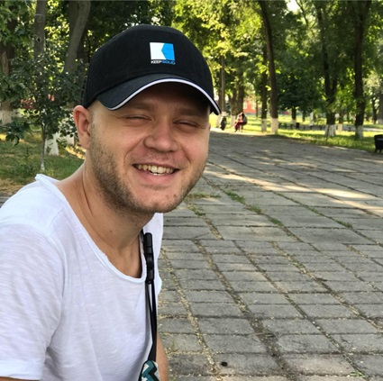
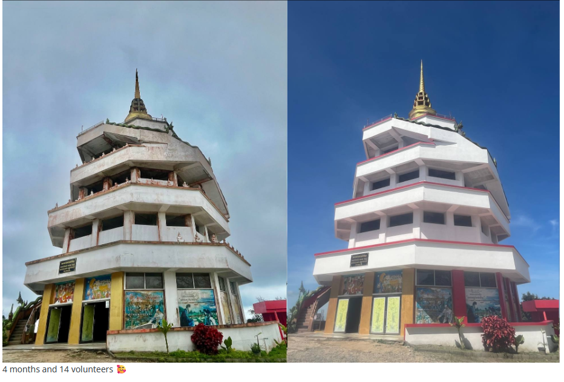

# Hey, I'm Sergii! 👋

<!--
**bapohka/bapohka** is a ✨ _special_ ✨ repository because its `README.md` (this file) appears on your GitHub profile.

Here are some ideas to get you started:

- 🔭 I’m currently working on ...
- 🌱 I’m currently learning ...
- 👯 I’m looking to collaborate on ...
- 🤔 I’m looking for help with ...
- 💬 Ask me about ...
- 📫 How to reach me: ...
- 😄 Pronouns: ...
- ⚡ Fun fact: ...
-->

<!--

-->

I am a 36 year old quality assurance and test engineer with more than 11y exp 
I am from Ukraine, Odesa :ukraine:.

I like:
- 🤖 Put my hands inside of computers / Arduino / IoT
- 🐍 I’m currently learning Python
- ⚡ Fun fact: testing haunts me throughout my life, and if there is any imperfection in the processes, I will face it
- 🌐 2022-2025 lived in Thailand :thailand:
- 🫀 While lived in Thailand I understand, that a lot of people are messed with how this country works. So I started volunteering for Ukrainian community - created guides, gave bureaucracy tips, help people in police and hospitals and a lot of more solved issues :safety_pin:
- :accessibility: Live in Sweden! 🇸🇪

# Proudest Projects

### [Telegram bot](https://github.com/bapohka/telegram-chatbot-gemini), using Google Gemini api for answer questions
My first bot, made using python, gemini api and telegram-bot library, without strict censorship in it

### [Filecloud.me](https://filecloud.me/)
File exchange service for fast and ad-free file exchange

### [Pure.app](https://pure.app/)
The best dating app without borders. For 5 Years I constantly made this app better 📱 

### [Renovation of Pagoda in Koh Samui, Thailand](https://aseannow.com/topic/1350347-ukrainian-volunteers-renovate-pra-buddha-d%C4%ABpankara-pagoda/#google_vignette)
It was a totally new volunteering experience for me. Gathering with several people, receiving blessing from monks, communication and planning with people speaking only Thai language, crazy bamboo construction and a lot of bad roads heading to that hill every morning for several months.

